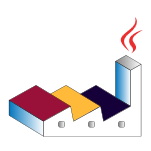

<div id="top"></div>
<!-- PROJECT SHIELDS -->
<!--
*** I'm using markdown "reference style" links for readability.
*** Reference links are enclosed in brackets [ ] instead of parentheses ( ).
*** See the bottom of this document for the declaration of the reference variables
*** for contributors-url, forks-url, etc. This is an optional, concise syntax you may use.
*** https://www.markdownguide.org/basic-syntax/#reference-style-links
-->
[![Contributors][contributors-shield]][contributors-url]
[![Forks][forks-shield]][forks-url]
[![Stargazers][stars-shield]][stars-url]
[![Issues][issues-shield]][issues-url]
[![MIT License][license-shield]][license-url]
[![LinkedIn][linkedin-shield]][linkedin-url]


<!-- PROJECT LOGO -->
<br />
<div align="center">
  <a href="https://github.com/hanifiamdev/plant-uml">
    
  </a>

  <h3 align="center">My Plant UML</h3>

  <p align="center">
    A way to manage my uml project
    <br />
    <a href="https://github.com/hanifiamdev/plant-uml"><strong>Explore the docs »</strong></a>
    <br />
    <br />
    <a href="https://github.com/hanifiamdev/plant-uml">View Demo</a>
    ·
    <a href="https://github.com/hanifiamdev/plant-uml/issues">Report Bug</a>
    ·
    <a href="https://github.com/hanifiamdev/plant-uml/issues">Request Feature</a>
  </p>
</div>


<!-- TABLE OF CONTENTS -->
<details>
  <summary>Table of Contents</summary>
  <ol>
    <li>
      <a href="#about-the-project">About The Project</a>
      <ul>
        <li><a href="#built-with">Built With</a></li>
      </ul>
    </li>
    <li>
      <a href="#getting-started">Getting Started</a>
      <ul>
        <li><a href="#prerequisites">Prerequisites</a></li>
        <li><a href="#installation">Installation</a></li>
      </ul>
    </li>
    <li><a href="#roadmap">Roadmap</a></li>
    <li><a href="#contributing">Contributing</a></li>
    <li><a href="#license">License</a></li>
    <li><a href="#contact">Contact</a></li>
    <li><a href="#acknowledgments">Acknowledgments</a></li>
  </ol>
</details>


<!-- ABOUT THE PROJECT -->
## About The Project

[![Product Name Screen Shot][product-screenshot]](https://github.com/hanifiamdev/plant-uml)

There are so many types of UML that exist,  it will be very difficult to learn one by one.   So by providing this UML project that I have created, I can learn it partially together with learning other things.

Here's why:
* Memory limitations to know all types of UML
* Become a  shelter centre related to project UML

<p align="right">(<a href="#top">back to top</a>)</p>


### Built With

* [Plantuml Integration](https://plugins.jetbrains.com/plugin/7017-plantuml-integration)

<p align="right">(<a href="#top">back to top</a>)</p>


<!-- GETTING STARTED -->
## Getting Started

How to setting up your project locally.

### Prerequisites

* java
* intellijIDEA
* Plugin Plantuml Integration


### Installation

Here's how to clone this repo project 

Clone the repo
   ```sh
   git clone https://github.com/hanifiamdev/plant-uml.git
   ```


<p align="right">(<a href="#top">back to top</a>)</p>


<!-- ROADMAP -->
## Roadmap

- [x] Add ERD
- [ ] Add Class Diagram

See the [open issues](https://github.com/hanifiamdev/plant-uml/issues) for a full list of proposed features (and known issues).

<p align="right">(<a href="#top">back to top</a>)</p>


<!-- CONTRIBUTING -->
## Contributing

Contributions are what make the open source community such an amazing place to learn, inspire, and create. Any contributions you make are **greatly appreciated**.

If you have a suggestion that would make this better, please fork the repo and create a pull request. You can also simply open an issue with the tag "enhancement".
Don't forget to give the project a star! Thanks again!

1. Fork the Project
2. Create your Feature Branch (`git checkout -b feature/AmazingFeature`)
3. Commit your Changes (`git commit -m 'Add some AmazingFeature'`)
4. Push to the Branch (`git push origin feature/AmazingFeature`)
5. Open a Pull Request

<p align="right">(<a href="#top">back to top</a>)</p>


<!-- LICENSE -->
## License

Distributed under the MIT License. See `LICENSE.txt` for more information.

<p align="right">(<a href="#top">back to top</a>)</p>


<!-- CONTACT -->
## Contact

Hanif Amrullah - hanifamrullahdev@gmail.com

Project Link: [https://github.com/hanifiamdev/plant-uml](https://github.com/hanifiamdev/plant-uml)

<p align="right">(<a href="#top">back to top</a>)</p>


<!-- ACKNOWLEDGMENTS -->
## Acknowledgments

Use this space to list resources you find helpful and would like to give credit to. I've included a few of my favorites to kick things off!

* [Plant UML](https://plantuml.com/)

<p align="right">(<a href="#top">back to top</a>)</p>


<!-- MARKDOWN LINKS & IMAGES -->
<!-- https://www.markdownguide.org/basic-syntax/#reference-style-links -->
[contributors-shield]: https://img.shields.io/github/contributors/hanifiamdev/plant-uml.svg?style=for-the-badge
[contributors-url]: https://github.com/hanifiamdev/plant-uml/graphs/contributors
[forks-shield]: https://img.shields.io/github/forks/hanifiamdev/plant-uml.svg?style=for-the-badge
[forks-url]: https://github.com/hanifiamdev/plant-uml/network/members
[stars-shield]: https://img.shields.io/github/stars/hanifiamdev/plant-uml.svg?style=for-the-badge
[stars-url]: https://github.com/hanifiamdev/plant-uml/stargazers
[issues-shield]: https://img.shields.io/github/issues/hanifiamdev/plant-uml.svg?style=for-the-badge
[issues-url]: https://github.com/hanifiamdev/plant-uml/issues
[license-shield]: https://img.shields.io/github/license/hanifiamdev/plant-uml.svg?style=for-the-badge
[license-url]: https://github.com/hanifiamdev/plant-uml/blob/master/LICENSE.txt
[linkedin-shield]: https://img.shields.io/badge/-LinkedIn-black.svg?style=for-the-badge&logo=linkedin&colorB=555
[linkedin-url]: https://linkedin.com/in/hanif-amrullah
[product-screenshot]: images/jumbotron.png
